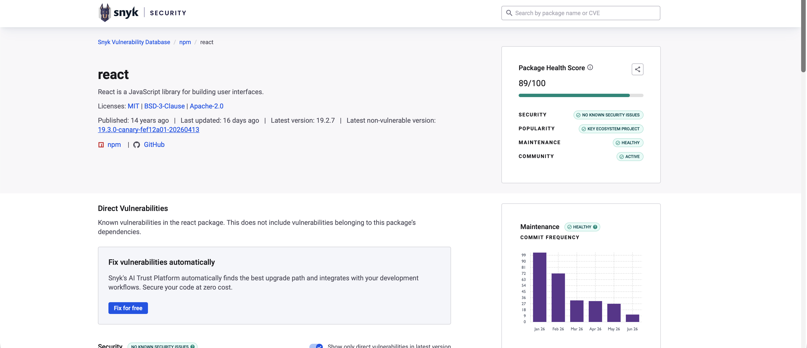
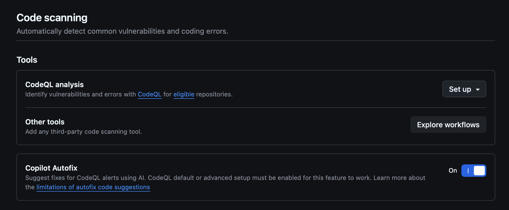
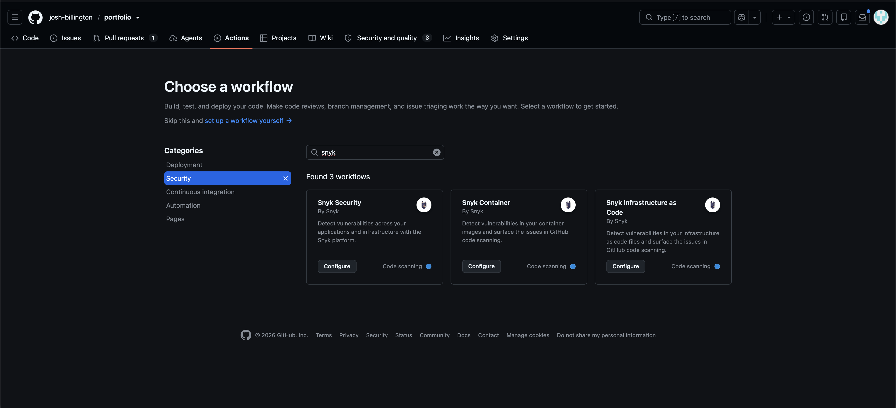
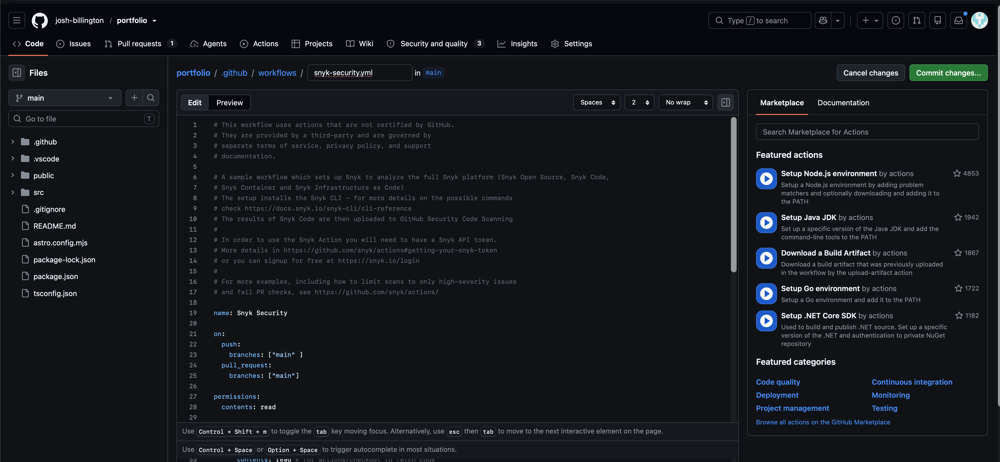
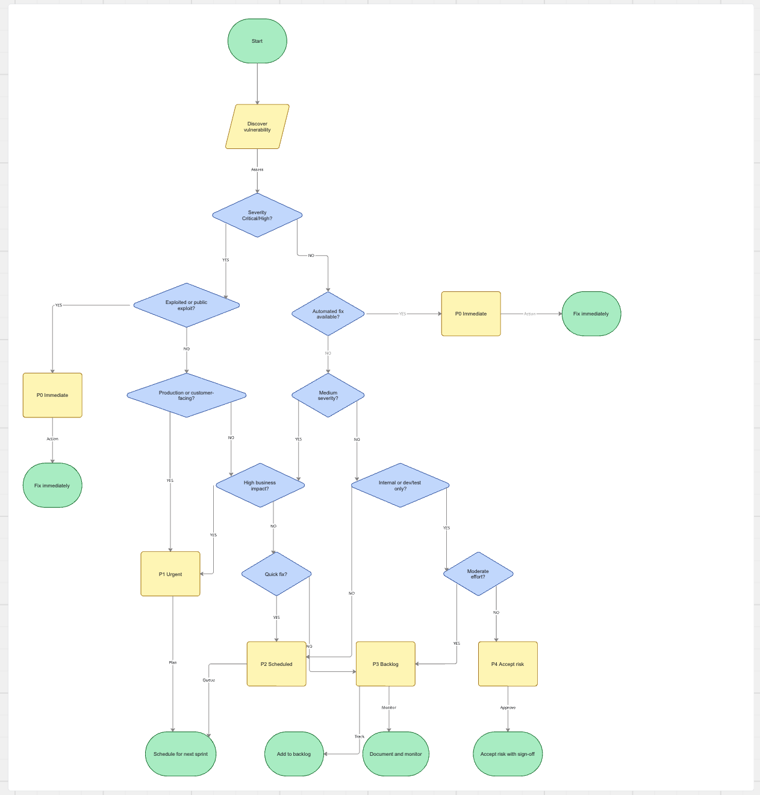

You’ve released your first product with the help of Cursor, Codex, or Claude Code. You’ve nailed the launch, you’ve got first paying customers, and suddenly you’re hit with a dreaded security incident… 

There’s no doubt that it’s faster and more productive to use these tools to build and launch your product, internal tool, or customer project. But how do you do that while ensuring that the code you ship isn’t riddled with vulnerabilities? 

Most security advice tosses around words like “zero trust architecture” or assume you have dedicated application security expertise. This is the first in a series of posts on the practical side of developing secure software. For transparency, I’m not an application security expert. These are the practical security principles that I learned and am taking forward from my time at Arctic Wolf.

The examples will be based on npm, but the principles are transferable to other ecosystems. 

## Do your homework

When you’re starting a new project, adding a new feature, or anytime you’re looking for a new package: take a few minutes to do your research. 

* Look the package up (if you’re using npm, go to npmjs.com): what you are looking for is: How many dependencies does the package have? When was the last time the package was updated? Does the package have an active roadmap (i.e. is it still maintained)? 

Snyk has a free resource: https://security.snyk.io, where you can look up packages from a number of ecosystems and get a clear picture of repository health, known vulnerabilities, and whether there are fixed upgrade paths for those vulnerabilities. 

## Pay your bills

Unfortunately, managing your dependencies doesn’t stop with checking them at the door. Packages are constantly evolving as their maintainers add new features, fix bugs, and patch vulnerabilities. 

You want to routinely check your dependency tree for updates and vulnerabilities.

A great place to start is with Dependabot (if you are using GitHub). You can configure Dependabot via the “Security and quality” tab on your repository. 

We’ll talk more static code analysis, agent skills, and agentic workflows for application in a later post. But, in Github you can configure “Code scanning” through CodeQL analysis or through a third party workflow (like Snyk). 

Search for the code analysis or security workflow that you want (I’m adding Snyk). 

And then follow the specific workflow instructions to add it to your repository. 

For npm specifically, I’d recommend a few additional steps: 

1. Adding npm audit audit-level=high to your deployment pipeline (if you’re using Github Actions - you’d create a workflow file in .github/workflows/<your file name>)
2. Commit your package-lock.json file and ensure that your deployment pipeline always uses npm ci
3. To resolve npm package updates utilize npm audit fix

## Prioritization

Now that you’ve found vulnerabilities, how do you decide what to fix first? 

This flowchart is designed to help you quickly categorize issues using severity, exploitability, impact, and effort. 

Key outcomes: 

* P0: should be fixed right now 
* P1: should be addressed with 1 - 2 weeks 
* P2: plan created to address with 1 - 3 months 
* P4: accept risk, document the vulnerability and monitor

## Getting started

The key to keeping your product, customer projects, and internal tools secure is consistency. If at 0, here’s where I’d start: 

* Run npm audit on your current project (bonus points for running Snyk CLI)
* Look up your top 5-10 dependencies on https://security.snyk.io.
* Set up Dependabot and CodeQL on GitHub
* Share the prioritization tree with your team

Measure progress by tracking: 

* Number of known vulnerabilties 
* % of dependencies that are up to date
* How long it takes from discovering a vulnerability to fixing it 

Up next: Buy don’t build
